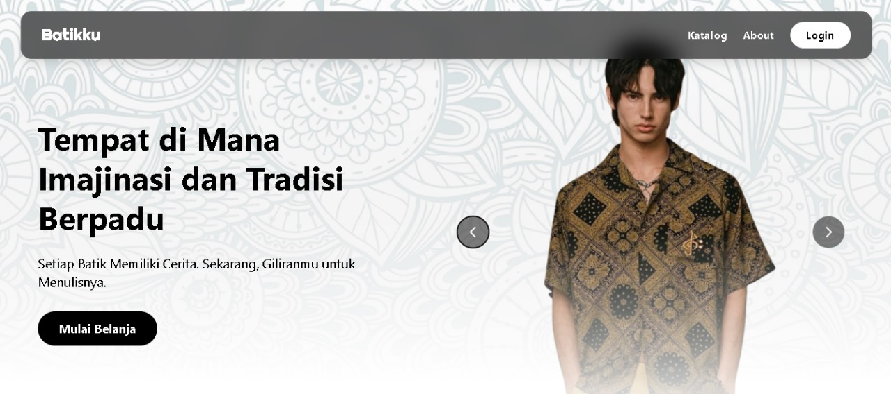
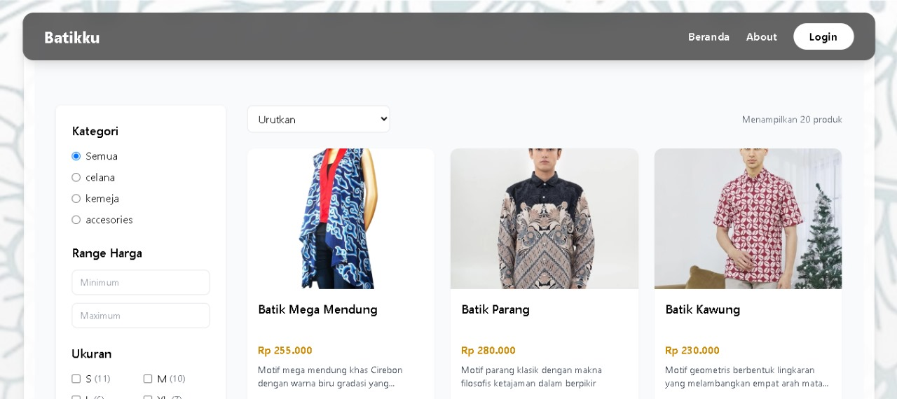
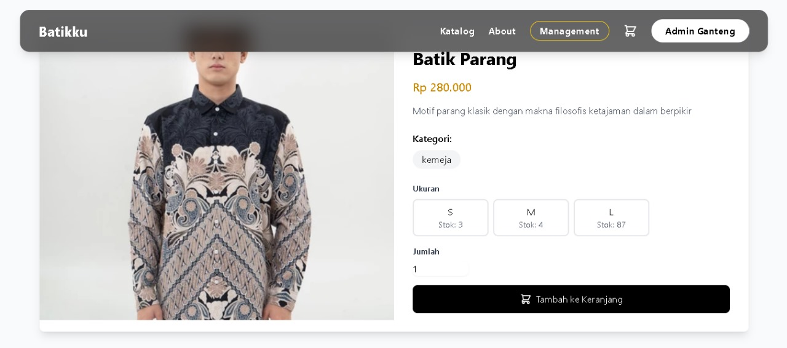
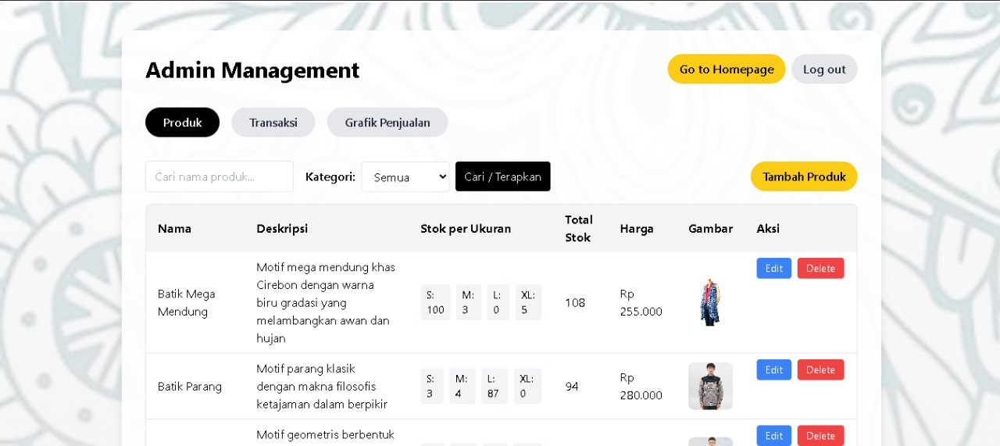
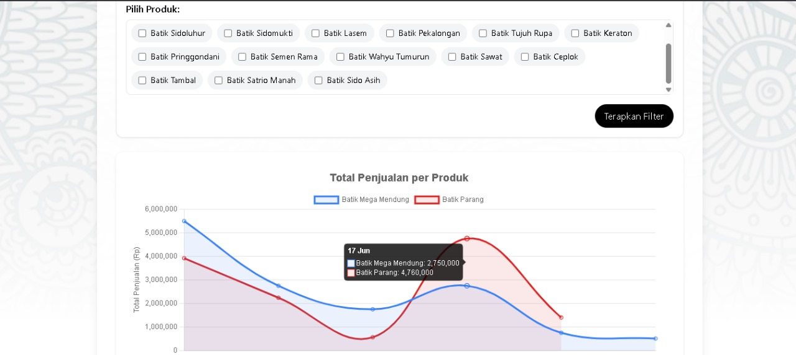

# 🧵 Batikku, Laravel CRUD for Local Batik Management




**Batikku** adalah aplikasi berbasis Laravel yang dirancang untuk mengelola katalog dan transaksi batik lokal secara terstruktur. Website ini memiliki **fitur lengkap**, mulai dari login, register, manajemen data produk, hingga peran admin dan user yang terpisah.

---

## ✨ Fitur Unggulan

- 🔐 Autentikasi (Login, Register, Logout)
- 🧑‍💼 Role-based Access (Admin & User)
- 📦 CRUD Data Batik (nama, deskripsi, harga)
- 📈 Dashboard Admin untuk kelola pengguna & katalog
- 🧭 Flow pengguna jelas dan lengkap, dari login hingga pembelian
- 🔒 Keamanan data melalui validasi form & pengecekan role
- 📁 Struktur project rapi dan mengikuti standar Laravel

---

## 🧭 Flow Aplikasi

1. **User** membuka halaman utama dan diarahkan ke halaman login.
2. Jika belum punya akun, bisa daftar melalui halaman register.
3. Setelah login berhasil:
   - Jika `admin`, akan diarahkan ke halaman manajemen data (user dan barang).
   - Jika `user`, bisa melihat katalog produk batik dan melakukan pembelian.
4. Seluruh data produk dikelola dengan sistem CRUD oleh admin.
5. Memiliki berbagai jenis filter mulai dari ketgori batik, min dan max harga, dan stok ukuran agar user bisa dengan mudah mengeksplorasi shop
6. Filter yang canggih untuk admin management produk
7. Grafik Statistik realtime untuk mendukung penuh admin dalam pengecekan transaksi serta variasi filter yang membantu
8. Data pengguna dapat dikontrol melalui panel admin untuk memastikan keamanan dan keteraturan sistem.

---
## 📸 Preview Website





## 🚀 Cara Menjalankan Project Ini

```bash
git clone https://github.com/altttttttivannn/Batikku.git
cd Batikku
composer install
cp .env.example .env
php artisan key:generate
# Konfigurasi database di .env
php artisan migrate
php artisan serve
